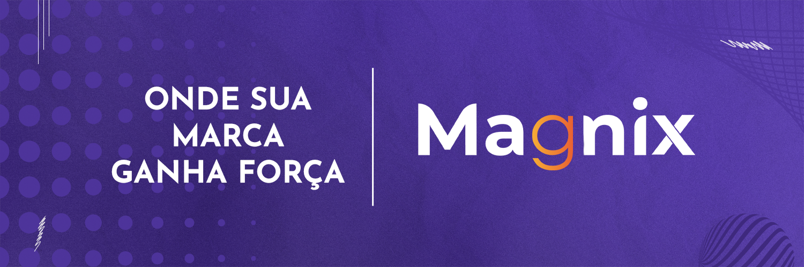

<p align="center">
  

  

  <a href="https://github.com/pedroeuzebiodev/agenciamagnix.com/commits/master">
    
  </a>

   

   <a href="https://github.com/pedroeuzebiodev/metodog.agenciamagnix.com/stargazers">
    
  </a>

  <a href="https://metodog.agenciamagnix.com">
    
  </a>
</p>

<h1 align="center">
  
</h1>

<h4 align="center">
 🚧  Magnix - Método G | Agência de Marketing 💛🧡 Concluído 🚀 🚧
</h4>

<p align="center">
 <a href="#-sobre-o-projeto">Sobre</a> •
 <a href="#-layout">Layout</a> •
 <a href="#-como-executar-o-projeto">Como executar</a> •
 <a href="#-tecnologias">Tecnologias</a> •
 <a href="#-contribuidores">Contribuidores</a> •
 <a href="#-autor">Autor</a> •
 <a href="#user-content--licença">Licença</a>
</p>

## 💻 Sobre o projeto

💛🧡 Magnix - Método G | Agência de Marketing - é uma vitrine do método G, uma estratégia de marketing social testada e aprovada em mais de 50 negócios, desenvolvida para entregar resultados reais full time. O diferencial? O Método G transforma completamente a maneira como você enxerga e executa suas ações de marketing, tudo em apenas 7 dias intensivos, divididos em três etapas essenciais.

---

## 🎨 Layout

O layout da aplicação está disponível no Figma:

<a href="https://www.figma.com/design/kcmtZZncEcXyJ7ToRnDF6o/Website-do-M%C3%A9todo-G-da-Magnix-%7C-Ag%C3%AAncia-de-Marketing?node-id=0-1&t=drOo3qxYvIr5RX1Q-1">
  
</a>

### Mobile

<p align="center">
  
</p>

### Web

<p align="center">
  
</p>

---

## 🚀 Como executar o projeto

### Pré-requisitos

Antes de começar, você vai precisar ter instalado em sua máquina a seguinte ferramenta e extensão: [Git](https://git-scm.com) e [Live Server](https://marketplace.visualstudio.com/items?itemName=ritwickdey.LiveServer). Além disto é bom ter um editor para trabalhar com o código como [VSCode](https://code.visualstudio.com/)

#### 🧭 Rodando o projeto

```bash

# Clone este repositório
$ git clone git@github.com:pedroeuzebiodev/metodog.agenciamagnix.com.git

# Acesse a pasta do projeto no seu terminal/cmd
$ cd metodog.agenciamagnix.com

# Abra o arquivo index.html com a extensão Live Server do VS Code

# A aplicação será aberta na porta:5500 - acesse http://127.0.0.1:5500

```

---

## 🛠 Tecnologias

As seguintes ferramentas foram usadas na construção do projeto:

#### **Website**

- **[HTML](https://developer.mozilla.org/pt-BR/docs/Web/HTML)**
- **[CSS](https://developer.mozilla.org/pt-BR/docs/Web/CSS)**
- **[PHP](https://www.php.net)**
- **[AOS - Animate on Scroll Library](https://michalsnik.github.io/aos/)**

#### **Utilitários**

- Protótipo: **[Figma](https://www.figma.com/)** → **[Protótipo (Website do Método G da Magnix | Agência de Magnix)](https://www.figma.com/design/kcmtZZncEcXyJ7ToRnDF6o/Website-do-M%C3%A9todo-G-da-Magnix-%7C-Ag%C3%AAncia-de-Marketing?node-id=0-1&t=drOo3qxYvIr5RX1Q-1)**
- Editor: **[Visual Studio Code](https://code.visualstudio.com/)** → Extensions: **[Live Server](https://marketplace.visualstudio.com/items?itemName=ritwickdey.LiveServer)**
- Markdown: **[StackEdit](https://stackedit.io/)**, **[Markdown Emoji](https://gist.github.com/rxaviers/7360908)**
- Commit Conventional: **[Commitlint](https://github.com/conventional-changelog/commitlint)**
- Fontes: **[Inter](https://fonts.google.com/specimen/Inter)**

---

## 👨‍💻 Contribuidores

💜 Um super thanks 👏 para essa galera que fez esse projeto sair do campo da ideia e entrar na internet :)

<table>
  <tr>
    <td align="center"><a href="https://www.instagram.com/findaryel"><br /><sub><b>Aryel</b></sub></a></td>
    <td align="center"><a href="https://www.linkedin.com/in/brian-sthefano/"><br /><sub><b>Brian Sthefano</b></sub></a></td>
    <td align="center"><a href="https://www.behance.net/gabrielsilva696"><br /><sub><b>Gabriel Silva</b></sub></a></td>
    <td align="center"><a href="https://www.linkedin.com/in/pedroeuzebio"><br /><sub><b>Pedro Euzebio</b></sub></a></td>
  </tr>
</table>

## 💪 Como contribuir para o projeto

1. Faça um **fork** do projeto.
2. Crie uma nova branch com as suas alterações: `git checkout -b my-feature`
3. Salve as alterações e crie uma mensagem de commit contando o que você fez: `git commit -m "feature: My new feature"`
4. Envie as suas alterações: `git push origin my-feature`

> Caso tenha alguma dúvida confira este [guia de como contribuir no GitHub](./CONTRIBUTING.md)

---

## 🦸 Autor

<a href="https://www.linkedin.com/in/pedroeuzebio">
 
 <br />
 <sub><b>Pedro Euzebio</b></sub>
</a>

<br>

<a href="mailto:pedroeuzebio.contato@gmail.com" class="contato">
        
      </a>
      <a href="https://www.linkedin.com/in/pedroeuzebio" class="contato">
        
      </a>
      <a href="https://www.youtube.com/@pedroeuzebiodev" class="contato">
        
      </a>

---

## 📝 Licença

Este projeto esta sobe a licença [MIT](./LICENSE).

Feito com ❤️ por Pedro Euzebio 👋 [Entre em contato!](https://www.linkedin.com/in/pedroeuzebio)
